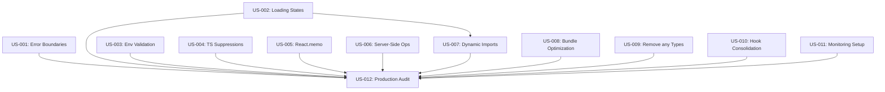

# Production Readiness & Code Quality Improvements

## Overview

This feature systematically addresses critical production readiness gaps, performance bottlenecks, and code quality concerns identified in a comprehensive codebase review. The implementation brings the gym manager application from 60% to 90%+ production readiness through targeted improvements across stability, performance, and maintainability.

## Problem Statement

### Current State Analysis

A comprehensive code review revealed significant gaps preventing safe production deployment:

**Critical Stability Issues (🔴)**:

- **Error Handling**: Only 2 of 10+ routes have error boundaries
- **Loading States**: Zero loading.tsx files across entire application
- **Environment Security**: 10 instances of unvalidated environment variable access
- **Type Safety**: TypeScript `@ts-nocheck` suppressing entire files

**High-Priority Performance Issues (⚠️)**:

- **Client-Side Operations**: Filtering/sorting large datasets (1000+ records) in browser
- **Missing Optimizations**: Only 19 of 50+ components use React.memo
- **Bundle Size**: Heavy libraries (~400KB charts) loaded statically
- **Hook Proliferation**: 99 hooks violating 4-hook-per-feature rule

**Code Quality Issues**:

- **Type Safety**: 92 files contain `any` types
- **Console Statements**: 10 files use console instead of logger utility
- **Documentation Gaps**: Missing index, performance, and monitoring docs

### Impact

| Issue                    | Current Impact                    | Risk Level  |
| ------------------------ | --------------------------------- | ----------- |
| Missing error boundaries | App crashes on unhandled errors   | 🔴 Critical |
| No loading states        | Poor UX, user confusion           | 🔴 Critical |
| Unvalidated env vars     | Runtime crashes possible          | 🔴 Critical |
| Client-side filtering    | Performance degrades >100 records | ⚠️ High     |
| Missing React.memo       | Unnecessary re-renders            | ⚠️ High     |
| Large bundle size        | Slow initial load times           | ⚠️ High     |
| Type safety issues       | Hidden bugs, poor DX              | 🟡 Medium   |
| Console statements       | No production logging             | 🟡 Medium   |

## Solution Architecture

### Strategic Approach

The solution is organized into 4 sequential sprints, each building on previous improvements:

```
Sprint 1: Critical Stability (Week 1)
    ↓ Enables safe error handling
Sprint 2: Performance (Weeks 2-3)
    ↓ Optimizes user experience
Sprint 3: Code Quality (Weeks 4-5)
    ↓ Improves maintainability
Sprint 4: Production Audit (Week 6)
    ↓ Validates readiness
```

### Component Architecture

**New Components**:

```
src/components/feedback/
├── AppErrorBoundary.tsx           # Consolidated error boundary
│   ├── Feature-specific context
│   ├── Error logging integration
│   ├── Recovery actions (reset, retry)
│   └── User-friendly messages
│
├── LoadingSkeleton.tsx            # Base skeleton component
│   └── Props: variant, count, className
│
└── skeletons/
    ├── TableSkeleton.tsx          # Data table loading
    ├── FormSkeleton.tsx           # Form loading
    ├── CardSkeleton.tsx           # Card loading
    ├── DetailPageSkeleton.tsx     # Detail view loading
    └── DashboardSkeleton.tsx      # Dashboard loading
```

**App Router Integration**:

```
src/app/
├── [route]/
│   ├── error.tsx                  # Error boundary (NEW)
│   ├── loading.tsx                # Loading state (NEW)
│   ├── page.tsx                   # Existing page
│   └── layout.tsx                 # Existing layout
```

### Type Organization

**Current**: Single 711-line `types.ts` file

**New Structure**:

```
src/features/database/lib/types/
├── index.ts                       # Barrel export
├── database.types.ts              # Core database types
├── member.types.ts                # Member + related
├── trainer.types.ts               # Trainer + related
├── session.types.ts               # Session + related
├── payment.types.ts               # Payment + related
├── subscription.types.ts          # Subscription + related
└── enums.types.ts                 # All enums
```

### Hook Consolidation Pattern

**Before** (25 specialized hooks):

```
use-member-count.ts
use-member-export.ts
use-member-search.ts
use-member-create.ts
... (21 more)
```

**After** (4 consolidated hooks):

```typescript
// use-members.ts - Main CRUD + search + export
export function useMembers(options) {
  // All member operations
}

// use-member-form.ts - Form management
export function useMemberForm(memberId) {
  // Form state + validation
}

// use-member-filters.ts - Filtering
export function useMemberFilters() {
  // Filter state + URL sync
}

// use-member-analytics.ts - Analytics
export function useMemberAnalytics() {
  // Stats + charts data
}
```

### Performance Optimization Strategy

**React Optimization**:

```typescript
// Pattern applied to all components >500 lines
export const LargeComponent = memo(function LargeComponent(props) {
  // useCallback for ALL event handlers
  const handleEvent = useCallback(() => {}, [deps]);

  // useMemo for ALL expensive operations
  const computed = useMemo(() => process(data), [data]);

  return <UI />;
});
```

**Server-Side Operations**:

```typescript
// Before: Client-side filtering
const filtered = allData.filter((item) => item.status === "active");

// After: Server-side filtering
const { data } = useQuery(["items", { status: "active" }], () =>
  fetchItems({ status: "active" })
);
```

**Dynamic Imports**:

```typescript
// Before: Static import (adds to bundle)
import { LineChart } from "recharts";

// After: Dynamic import (on-demand loading)
const LineChart = lazy(() =>
  import("recharts").then((m) => ({ default: m.LineChart }))
);
```

## Technical Specifications

### New Dependencies

```json
{
  "dependencies": {
    "@tanstack/react-virtual": "^3.x", // Virtual scrolling
    "@sentry/nextjs": "^7.x" // Error monitoring
  },
  "devDependencies": {
    "@next/bundle-analyzer": "^14.x" // Bundle analysis
  }
}
```

### Environment Variables

All variables validated through `src/lib/env.ts`:

```typescript
import { z } from "zod";

const envSchema = z.object({
  NEXT_PUBLIC_SUPABASE_URL: z.string().url(),
  NEXT_PUBLIC_SUPABASE_ANON_KEY: z.string().min(20),
  NEXT_PUBLIC_SENTRY_DSN: z.string().url().optional(),
  // ... all variables validated
});

export const env = envSchema.parse(process.env);
```

### Monitoring Setup

**Sentry Configuration**:

```typescript
// sentry.client.config.ts
Sentry.init({
  dsn: env.NEXT_PUBLIC_SENTRY_DSN,
  environment: process.env.NODE_ENV,
  tracesSampleRate: 1.0,
  replaysSessionSampleRate: 0.1,
  replaysOnErrorSampleRate: 1.0,
  integrations: [new Sentry.BrowserTracing(), new Sentry.Replay()],
});
```

**Performance Monitoring**:

- Core Web Vitals tracking
- Custom performance marks
- Database query monitoring
- Alert rules for thresholds

### Database Optimizations

**Query Pattern Changes**:

```typescript
// Before: Fetch all, filter client-side
const { data: allSessions } = useQuery(["sessions"], fetchAll);
const filtered = allSessions.filter((s) => s.trainer_id === id);

// After: Server-side filtering with Supabase query builder
const { data: sessions } = useQuery(["sessions", { trainer_id: id }], () =>
  supabase
    .from("training_sessions")
    .select("*")
    .eq("trainer_id", id)
    .order("date", { ascending: false })
);
```

**Pagination Pattern**:

```typescript
// Implemented with TanStack Query infinite queries
const { data, fetchNextPage, hasNextPage } = useInfiniteQuery({
  queryKey: ["members", filters],
  queryFn: ({ pageParam = 0 }) =>
    fetchMembers({
      ...filters,
      offset: pageParam * PAGE_SIZE,
      limit: PAGE_SIZE,
    }),
  getNextPageParam: (lastPage, pages) =>
    lastPage.length === PAGE_SIZE ? pages.length : undefined,
});
```

## Implementation Plan

### Sprint Breakdown

| Sprint   | Focus              | Stories          | Effort | Key Deliverables                                                  |
| -------- | ------------------ | ---------------- | ------ | ----------------------------------------------------------------- |
| Sprint 1 | Critical Stability | US-001 to US-004 | 28h    | Error boundaries, Loading states, Env validation                  |
| Sprint 2 | Performance        | US-005 to US-008 | 40h    | React.memo, Server-side ops, Dynamic imports, Bundle optimization |
| Sprint 3 | Code Quality       | US-009 to US-011 | 48h    | Type safety, Hook consolidation, Monitoring                       |
| Sprint 4 | Production Audit   | US-012           | 16h    | Final verification, Benchmarks, Documentation                     |

**Total Effort**: 132 hours (~6-8 weeks)

### User Story Dependencies



### Key Milestones

| Milestone           | Description             | Completion Criteria                               |
| ------------------- | ----------------------- | ------------------------------------------------- |
| **M1: Stability**   | Critical fixes complete | All error boundaries + loading states implemented |
| **M2: Performance** | Optimization complete   | Bundle <300KB, 30%+ re-render reduction           |
| **M3: Quality**     | Code quality improved   | Zero `any` types, hooks consolidated              |
| **M4: Production**  | Production ready        | 90%+ readiness score, all checks passing          |

## Success Metrics

### Quantitative Targets

| Metric                   | Before | After | Target |
| ------------------------ | ------ | ----- | ------ |
| **Production Readiness** | 60%    | TBD   | 90%+   |
| **Security Score**       | 95%    | TBD   | 98%+   |
| **Performance Score**    | 70%    | TBD   | 90%+   |
| **Code Quality**         | 78%    | TBD   | 95%+   |
| **Type Safety**          | 75%    | TBD   | 98%+   |

### Specific Metrics

**Stability**:

- Error boundaries: 2 → 10+ routes
- Loading states: 0 → 10+ routes
- Unvalidated env vars: 10 → 0

**Performance**:

- React re-renders: Baseline → -30%
- Bundle size: Current → <300KB per route
- Query time: Variable → <100ms average

**Code Quality**:

- Files with `any`: 92 → 0
- Console statements: 10 → 0
- Hooks per feature: 99 total → ~48 total (4 per feature)

### Core Web Vitals Targets

| Metric | Target | Description              |
| ------ | ------ | ------------------------ |
| FCP    | <1.5s  | First Contentful Paint   |
| LCP    | <2.5s  | Largest Contentful Paint |
| CLS    | <0.1   | Cumulative Layout Shift  |
| FID    | <100ms | First Input Delay        |
| TTI    | <3.5s  | Time to Interactive      |

## Testing Strategy

### Test Coverage

Each user story includes:

1. **Unit Tests**: New components and utilities
2. **Integration Tests**: Feature interactions
3. **Performance Tests**: Benchmarks for optimization
4. **E2E Tests**: Critical user flows

### Performance Testing

```typescript
// Example benchmark test
describe('Performance Benchmarks', () => {
  it('should load members page under 200ms', async () => {
    const start = performance.now();
    await fetchMembers({ limit: 50 });
    const duration = performance.now() - start;
    expect(duration).toBeLessThan(200);
  });

  it('should handle 1000 records with virtual scrolling', async () => {
    const members = generateMockMembers(1000);
    const { container } = render(
      <VirtualMembersTable members={members} />
    );
    // Verify smooth rendering
    expect(container).toBeInTheDocument();
  });
});
```

### Pre-Production Verification

```bash
#!/bin/bash
# scripts/pre-production-check.sh

echo "Running pre-production checks..."

npx tsc --noEmit || exit 1     # Type check
npm run lint || exit 1          # Lint check
npm test || exit 1              # Test check
npm run build || exit 1         # Build check
npm run analyze || exit 1       # Bundle analysis
npm audit --production || exit 1 # Security audit

echo "✅ All pre-production checks passed!"
```

## Documentation

### New Documentation Files

1. **docs/DATABASE-INDEXES.md**: Database index documentation
2. **docs/PERFORMANCE-BENCHMARKS.md**: Performance targets and testing
3. **docs/ERROR-HANDLING-GUIDE.md**: Error boundary patterns
4. **docs/COMPONENT-PATTERNS.md**: Component standards
5. **docs/MONITORING-SETUP.md**: Sentry and observability guide

### Updated Documentation

- **CLAUDE.md**: Reference implementation as example
- **README.md**: Updated with new patterns
- **RLS-POLICIES.md**: Verify all policies current

## Risks and Mitigation

| Risk                             | Impact | Probability | Mitigation                                       |
| -------------------------------- | ------ | ----------- | ------------------------------------------------ |
| Breaking changes during refactor | High   | Medium      | Comprehensive test coverage, incremental rollout |
| Performance regressions          | Medium | Low         | Benchmark testing, profiling before/after        |
| Type errors during migration     | Medium | Medium      | Gradual migration, TypeScript strict mode        |
| Bundle size increase             | High   | Low         | Bundle analyzer, dynamic imports                 |
| Hook consolidation complexity    | Medium | Medium      | Clear patterns, thorough testing                 |

## Rollout Plan

### Phase 1: Internal Testing (Week 7)

- Deploy to staging environment
- Internal QA testing
- Performance profiling
- Security audit

### Phase 2: Beta Testing (Week 8)

- Limited production rollout (10% users)
- Monitor error rates
- Gather performance metrics
- Collect user feedback

### Phase 3: Full Deployment (Week 9)

- Gradual rollout to 100%
- Monitor all metrics
- Ready rollback plan
- Documentation complete

## Maintenance

### Ongoing Monitoring

- **Error Tracking**: Sentry alerts for new errors
- **Performance**: Core Web Vitals monitoring
- **Bundle Size**: Automated bundle analysis on PRs
- **Type Safety**: Pre-commit hooks for TypeScript

### Code Review Guidelines

New code must:

- Use error boundaries for new routes
- Include loading states
- Follow React.memo patterns
- Use consolidated hooks
- Pass all quality checks

## References

### Internal Documentation

- **START-HERE.md**: Getting started guide
- **AGENT-GUIDE.md**: Implementation workflow
- **STATUS.md**: Progress tracking
- **CLAUDE.md**: Project standards

### External Resources

- [React.memo Documentation](https://react.dev/reference/react/memo)
- [Next.js Error Handling](https://nextjs.org/docs/app/building-your-application/routing/error-handling)
- [TanStack Virtual](https://tanstack.com/virtual/latest)
- [Sentry Next.js](https://docs.sentry.io/platforms/javascript/guides/nextjs/)

---

**Last Updated**: 2024-01-20
**Status**: Ready for Implementation
**Feature Branch**: `feature/production-readiness-improvements`
